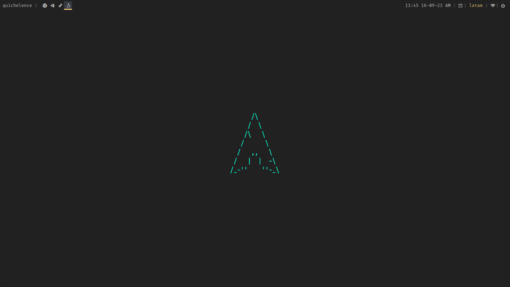

# Bryan Arevalo's dotfiles



# Needed packages

- qtile
- Dunst
- picom
- feh
- nm-applet
- polybar
- slack
- rofi
- nvim

# Arch instalation

```
$ sudo pacman -Sy qtile dunst picom feh networkmanager polybar rofi nvim
```

# Setup

### automatically

```
$ sudo bash ./setup.sh
```

## Scripts

- Copy every file on <scripts> folder into ~/.local/bin
- Run

```
$ sudo chmod 777 <script-list>
```

## Config files

- Copy the resting folders into ~/.config
